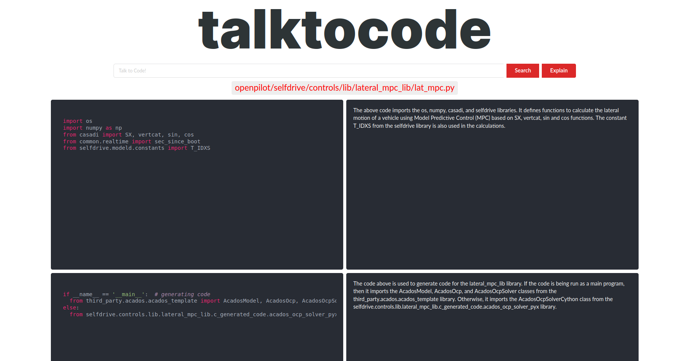
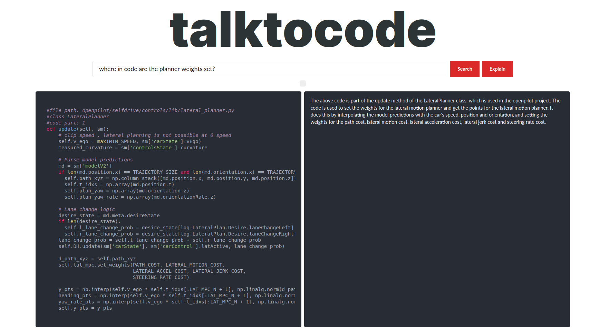
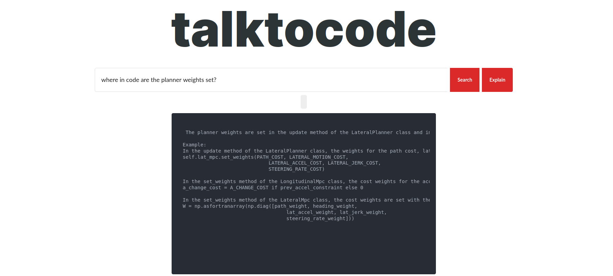

# TalkToCode

## Usage
- The colab has the preprocessing steps to embed a repository
[Open Colab](https://colab.research.google.com/drive/1jbC-26kWwX_zzRjFGcglRyUxliUvhxia#scrollTo=V34KdUwB3ubv)

- To run the app:
```
cd app && OPENAI_KEY=<key> python server.py
```

## Features
1. Browse code blocks and their summaries

2. Ask a question and "search" for the semantically relevant codeblocks

3. Ask a question and ask the model to "explain".



## Next Steps
- VSCode / Chrome extension

## Contributors
- [keerthanpg](https://github.com/keerthanpg)
- [nuwandavek](https://github.com/nuwandavek)